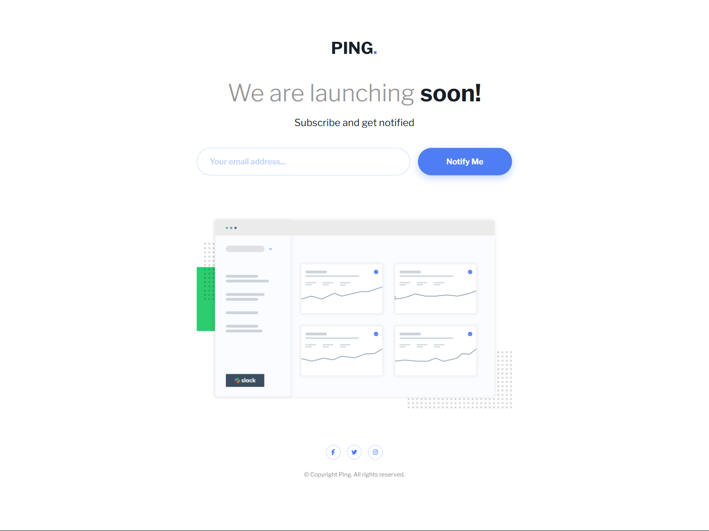
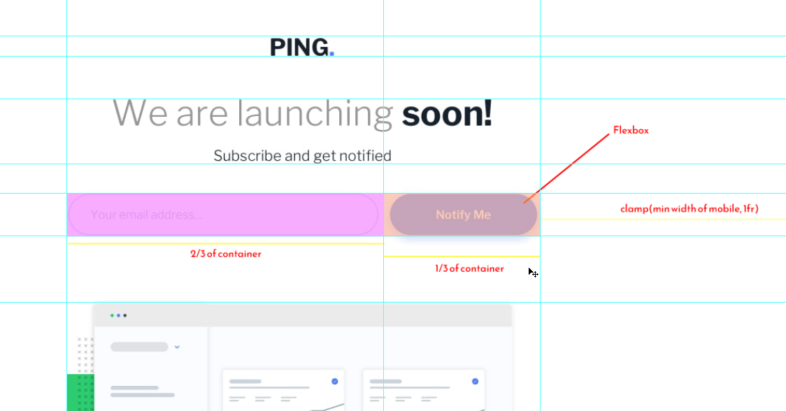

# JeffLangTech - Recipe page solution

This is a solution to the [Recipe page challenge on Frontend Mentor](https://www.frontendmentor.io/challenges/recipe-page-KiTsR8QQKm). 

## Table of contents

- [Overview](#overview)
  - [The challenge](#the-challenge)
  - [Preview](#preview)
  - [Links](#links)
- [My process](#my-process)
  - [Built with](#built-with)
  - [Step by step](#step-by-step)
  - [Continued development](#continued-development)
  - [Useful resources](#useful-resources)
- [Author](#author)

## Overview

### Preview



### Links

- Solution URL: [FrontEnd Mentor Solution]()
- Live Site URL: [Github](https://jefflangtech.github.io/coming-soon-component/)

## My process

### Built with

- Semantic HTML5 markup
- CSS custom properties
- Custom JS validation

### Step by step

This design didn't seem to lend itself to a straight-forward grid or flex container, using gap to separate out the components. So while it is a grid layout that's primarily for positioning the primary content and facilitating responsive design.

I find it helpful to markup a screenshot of the design:


The most fun stuff was in the custom email validation script, and I stuck pretty close to email standards, with the exception of the stranger stuff like allowing various special characters in quotes for the prefix, or a bracketed domain address for the hostname. I think my email validation is actually looser than hotmail, so that's something.

Another thing I did was to dynamically pull the text file from IANA to get all the approved top level domains (TLD), with the file being cached in local storage for a week. And that segment of the provided email address is checked against that list.

```js
// Fetch the top level domains list - text file
async function getTLDlist() {

  const cacheKey = 'tldList';
  const cacheTimeKey = 'tldTimeStamp';
  const maxAge = 1000 * 60 * 60 * 24 * 7;

  const cachedData = localStorage.getItem(cacheKey);
  const cachedTime = localStorage.getItem(cacheTimeKey);

  const isFresh = cachedData && cachedTime && (Date.now() - Number(cachedTime) < maxAge);

  if(isFresh) {
    return cachedData;
  }

  try {
    console.log('Fetching TLD data file');
    const url = 'https://data.iana.org/TLD/tlds-alpha-by-domain.txt';
    const response = await fetch(url);
    if(!response.ok) {
      throw new Error(`Response status: ${response.status}`);
    }
    const file = await response.text();
    if(!file) {
      throw new Error(`Error with file stream`);
    }

    localStorage.setItem(cacheKey, file);
    localStorage.setItem(cacheTimeKey, Date.now().toString());

    return file;
  }
  catch (error) {
    console.error(error.message);
    if(cachedData) {
      return cachedData;
    }
  }
}
```

### Continued development

My JS was pretty quick and dirty--I'd like to improve the structure and organization of my logic for future projects, but this was good enough for now. The next project I'm going to start rigorously improving my layout and styling speed. 

### Useful resources

- Heavy use of MDN this time around. But that's what it's there for!

## Author

- Website - [JeffLangTech](https://jefflangtech.github.io/)
- Frontend Mentor - [@jefflangtech](https://www.frontendmentor.io/profile/jefflangtech)